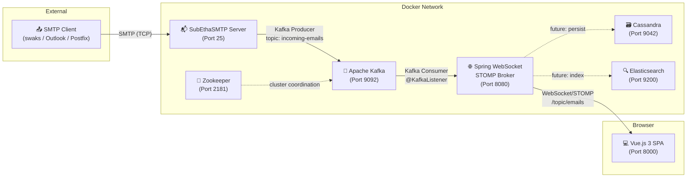
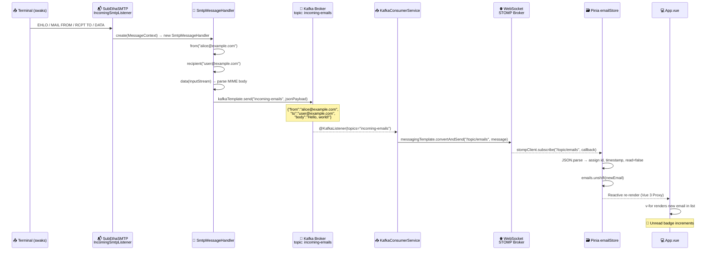
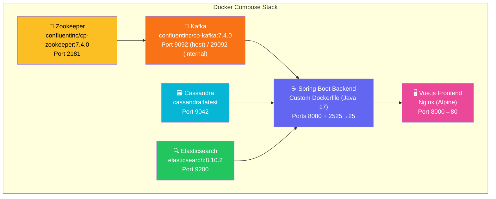
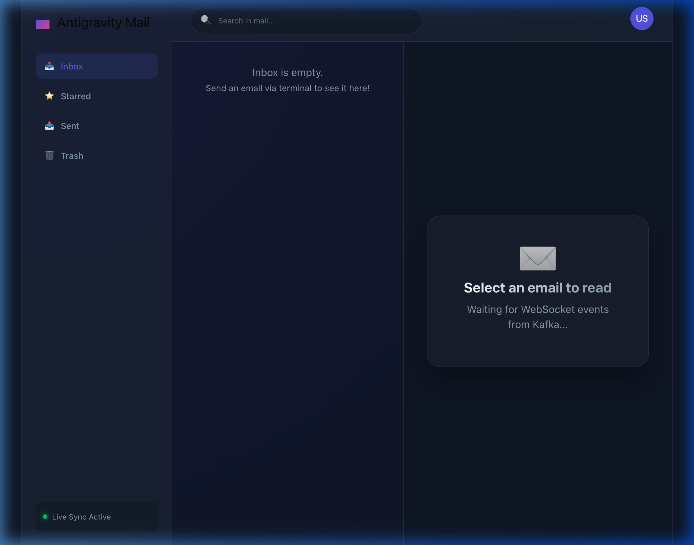
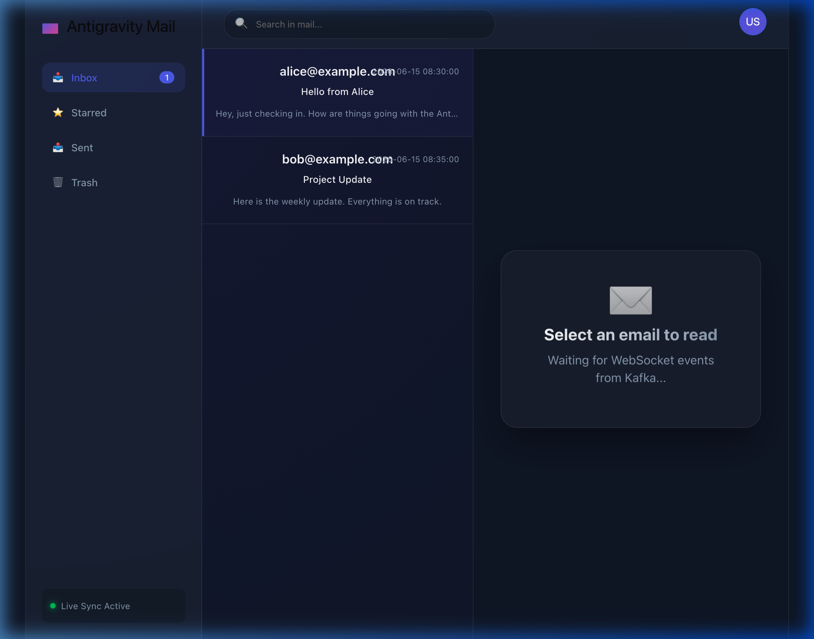
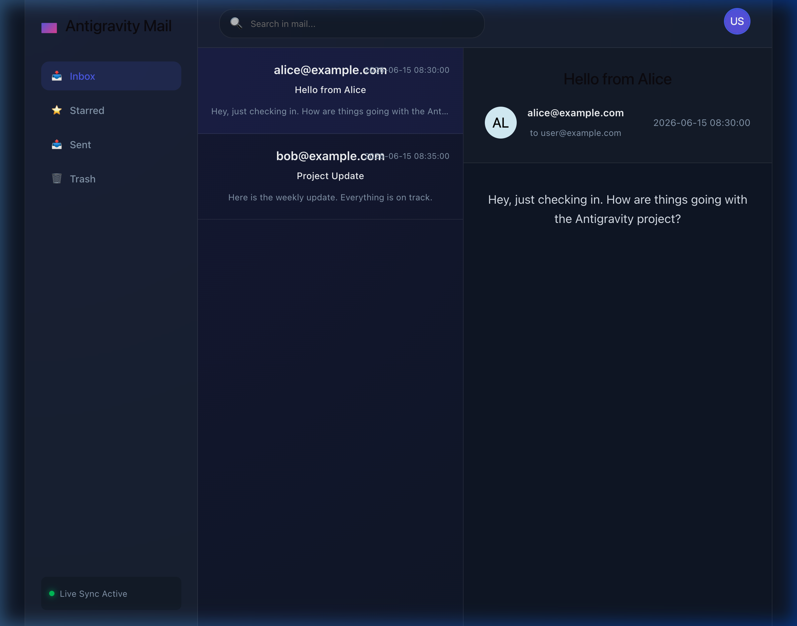

# 📧 Distributed Email Service — Antigravity Mail

A highly scalable, event-driven email service built with **Spring Boot**, **Apache Kafka**, **Vue.js 3**, and **WebSockets**. This system receives emails via SMTP, publishes them through Kafka, and delivers them in real-time to a modern web client — mirroring the architecture of enterprise platforms like Gmail.

---

## Table of Contents

- [Architecture Overview](#architecture-overview)
- [End-to-End Code Flow](#end-to-end-code-flow)
- [Backend — Deep Dive](#backend--deep-dive)
  - [Packages & Dependencies](#backend-packages--dependencies)
  - [File-by-File Breakdown](#backend-file-by-file-breakdown)
- [Frontend — Deep Dive](#frontend--deep-dive)
  - [Packages & Dependencies](#frontend-packages--dependencies)
  - [File-by-File Breakdown](#frontend-file-by-file-breakdown)
- [Infrastructure Services](#infrastructure-services)
- [Docker Deployment](#docker-deployment)
- [Screenshots](#screenshots)

---

## Architecture Overview

The system is composed of **6 containerized services** communicating through a combination of SMTP, Kafka event streaming, and WebSocket push channels.



### Data Flow Summary

| Step | Protocol | From | To | Action |
|------|----------|------|------|--------|
| 1 | SMTP (TCP:25) | External Mail Client | `IncomingSmtpListener` | Raw MIME envelope received |
| 2 | Internal | `SmtpMessageHandler` | `KafkaTemplate` | JSON payload published to `incoming-emails` topic |
| 3 | Kafka | `incoming-emails` topic | `KafkaConsumerService` | Message consumed by consumer group |
| 4 | WebSocket/STOMP | `SimpMessagingTemplate` | Vue.js Client | Real-time push to `/topic/emails` |
| 5 | Reactive UI | Pinia Store | `App.vue` | Email rendered in inbox list |

---

## End-to-End Code Flow

This section traces a single email from the moment it is sent via terminal to the moment it appears on screen.



### Step-by-Step Walkthrough

#### Step 1 — SMTP Reception

An external client sends an email using the SMTP protocol. For testing, the `swaks` CLI tool is used:

```bash
swaks --to user@example.com \
      --from alice@example.com \
      --server localhost:2525 \
      --header "Subject: Hello from Alice" \
      --body "Hey, just checking in. How are things going with the Antigravity project?"
```

The `IncomingSmtpListener` component starts a **SubEthaSMTP** server on port 25 inside the container (mapped to host port `2525`). When the TCP connection arrives, SubEthaSMTP invokes the `SmtpMessageHandlerFactory` to create a new `SmtpMessageHandler` instance for this SMTP session.

#### Step 2 — MIME Parsing & Kafka Publishing

The `SmtpMessageHandler` implements SubEthaSMTP's `MessageHandler` interface and is called in sequence:

1. **`from(String from)`** — Captures the sender address from `MAIL FROM:`
2. **`recipient(String recipient)`** — Captures the recipient from `RCPT TO:`
3. **`data(InputStream data)`** — Reads the raw MIME payload, constructs a JSON string, and publishes to Kafka:

```java
String jsonPayload = String.format(
    "{\"from\":\"%s\", \"to\":\"%s\", \"body\":\"%s\"}",
    this.from, this.recipient, safeBody
);
kafkaTemplate.send("incoming-emails", jsonPayload);
```

The `KafkaTemplate<String, String>` is auto-configured by Spring Boot using the `spring.kafka.bootstrap-servers` property.

#### Step 3 — Kafka Consumption

`KafkaConsumerService` uses Spring Kafka's `@KafkaListener` annotation to subscribe to the `incoming-emails` topic as part of the `email-consumer-group` consumer group:

```java
@KafkaListener(topics = "incoming-emails", groupId = "email-consumer-group")
public void consume(String message) {
    messagingTemplate.convertAndSend("/topic/emails", message);
}
```

#### Step 4 — WebSocket Push to Browser

The consumed message is immediately forwarded to all connected WebSocket clients via Spring's `SimpMessagingTemplate`. The STOMP destination `/topic/emails` is configured in `WebSocketConfig`:

```java
config.enableSimpleBroker("/topic");          // Subscribe prefix
config.setApplicationDestinationPrefixes("/app");  // Send prefix
registry.addEndpoint("/ws-email").withSockJS();    // SockJS fallback
```

#### Step 5 — Frontend Reactive Rendering

The Vue.js Pinia store (`emailStore.js`) subscribes to the STOMP topic on mount:

```javascript
this.stompClient.subscribe('/topic/emails', (message) => {
    const newEmail = JSON.parse(message.body)
    newEmail.id = Date.now()
    newEmail.read = false
    newEmail.timestamp = new Date().toLocaleTimeString(...)
    this.emails.unshift(newEmail)    // Prepend to list
})
```

Vue 3's **Proxy-based reactivity** detects the array mutation, triggering a re-render of the `v-for` loop in `App.vue`. The unread badge in the sidebar updates automatically via the `unreadCount` getter.

---

## Backend — Deep Dive

### Backend Packages & Dependencies

| Package (Maven groupId:artifactId) | Version | Purpose |
|---|---|---|
| `org.springframework.boot:spring-boot-starter-web` | 3.1.5 | Embedded Tomcat, REST controller support, HTTP server |
| `org.springframework.boot:spring-boot-starter-websocket` | 3.1.5 | STOMP over WebSocket with SockJS fallback |
| `org.springframework.boot:spring-boot-starter-data-cassandra` | 3.1.5 | Spring Data interface for Apache Cassandra |
| `org.springframework.kafka:spring-kafka` | (managed) | `KafkaTemplate` producer + `@KafkaListener` consumer |
| `org.subethamail:subethasmtp` | 3.1.7 | Lightweight embeddable SMTP server (Java) |
| `com.sun.mail:javax.mail` | 1.6.2 | JavaMail API for MIME parsing utilities |
| `org.springframework.boot:spring-boot-starter-test` | 3.1.5 | JUnit 5 + Mockito test framework |
| `org.springframework.kafka:spring-kafka-test` | (managed) | Embedded Kafka for integration tests |

### Backend File-by-File Breakdown

```
backend/src/main/java/com/emailservice/backend/
├── BackendApplication.java              ← Spring Boot entry point
├── config/
│   └── WebSocketConfig.java             ← STOMP/SockJS endpoint configuration
├── kafka/
│   └── KafkaConsumerService.java        ← Kafka → WebSocket bridge
└── smtp/
    ├── IncomingSmtpListener.java        ← Starts/stops SubEthaSMTP server
    ├── SmtpMessageHandlerFactory.java   ← Factory: creates handler per SMTP session
    └── SmtpMessageHandler.java          ← Parses SMTP envelope → publishes to Kafka
```

#### `BackendApplication.java`
Spring Boot entry point. `@SpringBootApplication` enables component scanning, auto-configuration, and bootstraps the embedded Tomcat + all `@Component` beans.

#### `config/WebSocketConfig.java`
Implements `WebSocketMessageBrokerConfigurer` to configure:
- **Simple Broker**: `/topic` prefix — clients subscribe here
- **Application Prefix**: `/app` — clients send messages here (future use)
- **STOMP Endpoint**: `/ws-email` with SockJS fallback and permissive CORS (`*`)

#### `smtp/IncomingSmtpListener.java`
A Spring `@Component` that manages the SubEthaSMTP server lifecycle:
- **`@PostConstruct start()`** — Creates `SMTPServer` on port 25 and starts listening
- **`@PreDestroy stop()`** — Gracefully shuts down the SMTP server

#### `smtp/SmtpMessageHandlerFactory.java`
Implements SubEthaSMTP's `MessageHandlerFactory`. For each incoming SMTP connection, it creates a new `SmtpMessageHandler` with an injected `KafkaTemplate`.

#### `smtp/SmtpMessageHandler.java`
Implements `MessageHandler` with the full SMTP transaction lifecycle:
- **`from()`** → stores sender address
- **`recipient()`** → stores recipient address
- **`data()`** → reads raw `InputStream`, escapes special characters, constructs JSON, and calls `kafkaTemplate.send("incoming-emails", jsonPayload)`
- **`done()`** → transaction complete (no-op)

#### `application.yml`
```yaml
spring:
  kafka:
    bootstrap-servers: ${SPRING_KAFKA_BOOTSTRAP_SERVERS:localhost:9092}
    consumer:
      group-id: email-storage-group
      auto-offset-reset: earliest
      key-deserializer: StringDeserializer
      value-deserializer: StringDeserializer
  cassandra:
    contact-points: ${SPRING_CASSANDRA_CONTACTPOINTS:localhost}
    port: 9042
    local-datacenter: datacenter1
    keyspace-name: email_service
```

---

## Frontend — Deep Dive

### Frontend Packages & Dependencies

| Package (npm) | Version | Purpose |
|---|---|---|
| `vue` | ^3.5.34 | Reactive UI framework (Composition API, Proxy-based reactivity) |
| `pinia` | ^2.1.7 | State management for Vue 3 (replaces Vuex) |
| `@stomp/stompjs` | ^7.0.0 | STOMP protocol client over WebSocket |
| `sockjs-client` | ^1.6.1 | SockJS fallback transport for browsers that don't support native WebSocket |
| `vite` | ^8.0.12 | Next-gen frontend build tool (ESM-native, HMR) |
| `@vitejs/plugin-vue` | ^6.0.6 | Vite plugin for `.vue` SFC compilation |

### Frontend File-by-File Breakdown

```
frontend/src/
├── main.js                  ← Vue app bootstrap + Pinia install
├── App.vue                  ← Single-file component (template + script + style)
├── store/
│   └── emailStore.js        ← Pinia store: WebSocket connection + email state
├── style.css                ← Global base styles
└── assets/                  ← Static images (logo SVGs, hero image)
```

#### `main.js`
Bootstraps the Vue 3 application:
```javascript
const app = createApp(App)
app.use(createPinia())       // Install Pinia for state management
app.mount('#app')            // Mount to <div id="app"> in index.html
```

#### `store/emailStore.js`
The **Pinia store** is the heart of the frontend. It manages:

| Property | Type | Purpose |
|---|---|---|
| `emails` | `Array` | List of received email objects |
| `selectedEmail` | `Object\|null` | Currently selected email for the reading pane |
| `stompClient` | `Client\|null` | Active STOMP client instance |
| `connected` | `Boolean` | WebSocket connection status |

**Key Actions:**

- **`connectWebSocket()`** — Creates a SockJS socket to `http://localhost:8080/ws-email`, wraps it in a STOMP client, subscribes to `/topic/emails`, and pushes incoming messages into the `emails` array.
- **`selectEmail(email)`** — Sets `selectedEmail` and marks the email as `read = true`.

**Getters:**
- **`unreadCount`** — Computed count of emails where `read === false`. Drives the sidebar badge.

#### `App.vue`
A single-file component containing:

**Template** — Three-panel layout:
1. **Sidebar** (260px) — Brand logo, folder navigation (Inbox/Starred/Sent/Trash), unread badge, connection status indicator
2. **Email List** (400px) — Scrollable list with sender, subject, preview, timestamp. Unread items have a left accent border.
3. **Reading Pane** (flex) — Either a glassmorphism "Select an email" placeholder, or full email details (subject, sender avatar, recipient, timestamp, body)

**Script** — Uses Composition API (`<script setup>`). Calls `emailStore.connectWebSocket()` in `onMounted()`.

**Style** — Premium dark theme using CSS custom properties:

| Variable | Value | Usage |
|---|---|---|
| `--bg-dark` | `#0f172a` | Base background |
| `--bg-panel` | `rgba(30, 41, 59, 0.7)` | Glassmorphism panels |
| `--accent` | `#6366f1` | Indigo accent (buttons, badges, borders) |
| `--text-main` | `#f8fafc` | Primary text |
| `--text-muted` | `#94a3b8` | Secondary text |
| `--border` | `rgba(255, 255, 255, 0.08)` | Subtle borders |

Key CSS techniques: `backdrop-filter: blur()`, `radial-gradient` backgrounds, `@keyframes float` animation on the empty-state panel, and `text-overflow: ellipsis` for email previews.

---

## Infrastructure Services



| Service | Image | Port Mapping | Depends On | Volume |
|---|---|---|---|---|
| Zookeeper | `confluentinc/cp-zookeeper:7.4.0` | 2181:2181 | — | — |
| Kafka | `confluentinc/cp-kafka:7.4.0` | 9092:9092 | Zookeeper | — |
| Cassandra | `cassandra:latest` | 9042:9042 | — | `cassandra_data` |
| Elasticsearch | `elasticsearch:8.10.2` | 9200:9200 | — | `es_data` |
| Backend | Custom (Maven + JRE 17) | 8080:8080, 2525:25 | Kafka, Cassandra, ES | — |
| Frontend | Custom (Node 22 + Nginx) | 8000:80 | Backend | — |

### Docker Build Strategy

Both the backend and frontend use **multi-stage Docker builds** to minimize image size:

**Backend Dockerfile:**
```
Stage 1 (build):   maven:3.9.4-eclipse-temurin-17 → mvn package
Stage 2 (runtime): eclipse-temurin:17-jre → java -jar app.jar
```

**Frontend Dockerfile:**
```
Stage 1 (build):   node:22-alpine → npm install && npm run build
Stage 2 (runtime): nginx:stable-alpine → serve /dist as static files
```

---

## Docker Deployment

### Prerequisites
- Docker and Docker Compose installed
- Ports 2181, 8000, 8080, 9042, 9092, 9200 available

### Launch

```bash
# Clone the repository
git clone https://github.com/parthu-reddy/EmailSystem.git
cd EmailSystem

# Start all 6 services
docker-compose up -d --build
```

### Test with a sample email

```bash
# Install swaks (SMTP testing tool)
# macOS: brew install swaks
# Ubuntu: sudo apt install swaks

swaks --to user@example.com \
      --from alice@example.com \
      --server localhost:2525 \
      --header "Subject: Hello from Alice" \
      --body "Hey, just checking in. How are things going with the Antigravity project?"
```

Then open **http://localhost:8000** in your browser — the email appears in real-time.

### Service Endpoints

| Service | URL |
|---|---|
| Frontend UI | http://localhost:8000 |
| Backend REST API | http://localhost:8080 |
| WebSocket Endpoint | ws://localhost:8080/ws-email |
| SMTP Server | localhost:2525 |
| Kafka Broker | localhost:9092 |
| Cassandra CQL | localhost:9042 |
| Elasticsearch | http://localhost:9200 |

---

## Screenshots

### Empty Inbox
The landing state when no emails have been received. Shows the three-panel layout with sidebar navigation, email list, and a glassmorphism reading pane with live WebSocket status.



### Inbox with Emails
Emails arrive in real-time as Kafka events are consumed and pushed via WebSocket/STOMP. Unread emails are distinguished with bold styling and a left accent border. The sidebar badge shows the unread count.



### Email Detail View
Clicking an email opens the full message in the reading pane — displaying subject, sender avatar, recipient, timestamp, and body. The email is automatically marked as read.



---

## Project Structure

```
EmailSystem/
├── README.md                          ← This file
├── docker-compose.yml                 ← Orchestrates all 6 services
├── .gitignore
│
├── backend/                           ← Spring Boot (Java 17)
│   ├── Dockerfile                     ← Multi-stage: Maven build → JRE runtime
│   ├── pom.xml                        ← Maven dependencies
│   └── src/main/
│       ├── java/com/emailservice/backend/
│       │   ├── BackendApplication.java
│       │   ├── config/
│       │   │   └── WebSocketConfig.java
│       │   ├── kafka/
│       │   │   └── KafkaConsumerService.java
│       │   └── smtp/
│       │       ├── IncomingSmtpListener.java
│       │       ├── SmtpMessageHandlerFactory.java
│       │       └── SmtpMessageHandler.java
│       └── resources/
│           └── application.yml
│
├── frontend/                          ← Vue.js 3 SPA
│   ├── Dockerfile                     ← Multi-stage: Vite build → Nginx serve
│   ├── package.json                   ← npm dependencies
│   ├── vite.config.js
│   ├── index.html                     ← SPA entry point
│   └── src/
│       ├── main.js                    ← Vue + Pinia bootstrap
│       ├── App.vue                    ← Root component (template + style)
│       └── store/
│           └── emailStore.js          ← Pinia: WebSocket + email state
│
└── screenshots/                       ← README images
    ├── inbox_empty.png
    ├── inbox_with_emails.png
    └── email_detail.png
```

---

## License

This project is open-source and available under the [MIT License](LICENSE).
